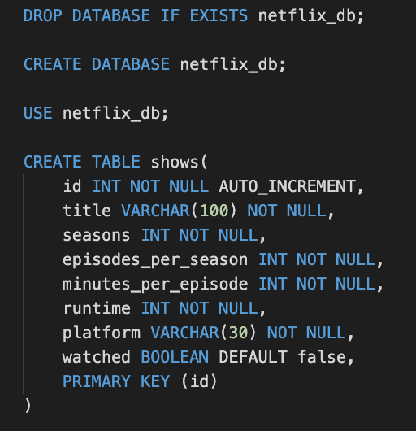

# ShowBinger

During the COVID-19 lockdown, many have had no choice but to turn to binge-worthy TV as a way to pass all the time inside. This application uses a SQL databse to help these avid TV watchers keep track of their escapades. Users can create a list of shows which they would like to watch, and slowly check these shows off the list overtime. The application stores the user's TV choices in a database, and allows them to see just how many new favorite shows were discovered during quarantine, as well as just how much time they have spent conquering season after season.

## Contents

* [Installing](#installing)
* [Built With](#built-with)
* [Application Functionality](#application-functionality)
* [Deployed Application](https://secure-depths-32676.herokuapp.com/)
* [Developer Information](#gabriel-sucich)

## Installing

To access code for use or development, clone the Github repository onto your local machine using:

```
git clone https://github.com/GabeSucich/ShowBinger.git
```

To download the necessary dependencies, navigate into the cloned directory and enter the following in terminal:

```
npm install
```

For testing with a local mySQL database, download the [mySQL workbench](https://dev.mysql.com/downloads/workbench/). Copy and past the following text from the schema.sql file into your mySQL workbench, and run to initialize your own database:



## Built With

* [HTML](https://developer.mozilla.org/en-US/docs/Web/HTML)
* [Javascript](https://developer.mozilla.org/en-US/docs/Web/JavaScript)
* [Materialize](https://materializecss.com/about.html)
* [mySql](https://www.npmjs.com/package/mysql)
* [Express](https://www.npmjs.com/package/express-handlebars)
* [Express-Handlebars](https://www.npmjs.com/package/express-handlebars)

## Application Functionality

Users can add a new show that they wish to watch. This will be added to the watchlist. After finishing a show, users can move it out of the watchlist into the favorite list. If it wasn't a favorite, they can delete it from the application.


#### See the [deployed link](https://secure-depths-32676.herokuapp.com/) here

### Gabriel Sucich


- [Portfolio](https://gabesucich.github.io/UpdatedPortfolio/)
- [Github](https://github.com/GabeSucich)
- [LinkedIn](www.linkedin.com/in/gabriel-sucich-6a28a71a8)

See also the list of any other [contributors](https://github.com/GabeSucich/ShowBinger/contributors) who on this project.


